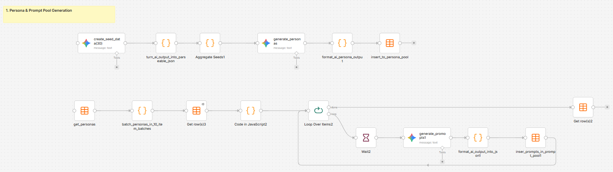
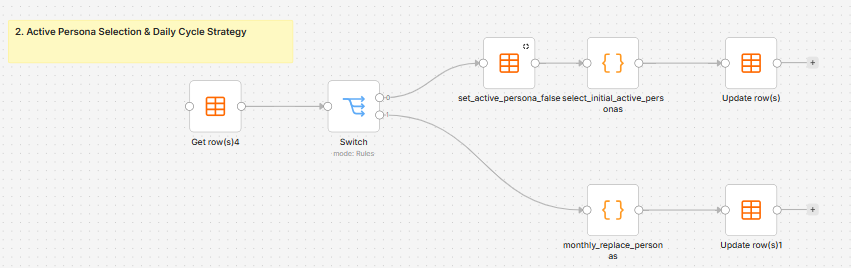
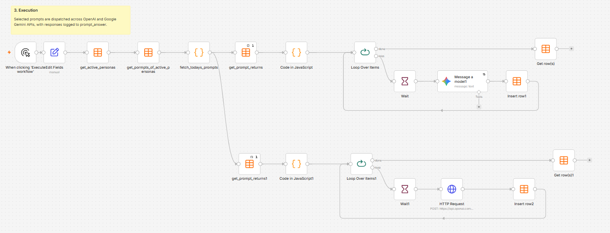

# Automated GEO (Generative Engine Optimization) Audit System

An (work in progress) automated pipeline to analyze and monitor brand visibility across major Large Language Models (OpenAI ChatGPT \& Google Gemini). The system measures how generative search engines perceive, categorize, and recommend a brand across various stages of the customer journey.

Currently build in n8n.

### Case Study Target: Freya Art Route

* **Product:** A web application generating curated walking art routes through museums, galleries, and cultural landmarks in Beyoğlu, Istanbul.
* **Current Brand Profile:** A high-potential, emerging tool with an active social media presence (Instagram, YouTube) but an evolving footprint in LLM indexation.

## System Architecture & Workflow

**The pipeline consists of 3 primary asynchronous workflows:**

### **1. Persona & Prompt Pool Generation**
Brand identity -> seeds -> personas -> prompt 
* **Brand Identity Matrix:** Synthesizes a structured JSON identity from scraped brand assets (website, social channels, external profiles), refined via Human-In-The-Loop (HITL) input.
* **Seed \& Persona Generation:** Extracts core user goals and pain points per seed to generate realistic buyer personas saved to personas_pool.
* **Prompt Pool Expansion:** Automatically expands each persona into a matrix of targeted queries, stored in prompt_pool.

### **2. Active Persona Selection & Daily Cycle Strategy**
* **Macro-Rotation (Monthly):** Uses usage-weighted scoring and a modified Fisher-Yates shuffle to rotate out \~30% of active personas monthly.
* **Micro-Rotation (Daily):** Dynamically isolates active personas using a deterministic dayOfYear % target\_personas modulo algorithm, guaranteeing balanced round-robin execution.

### **3. Execution:** 
* Selected prompts are dispatched across OpenAI and Google Gemini APIs, with responses logged to prompt_answer.

### **Data Tabels**
* **seed_pool:** seed_id,lifecycle_stage,primary_intent,key_pain_points,contextual_barrier,usage_count,persona_cycle.  
* **personas_pool:** persona_id,lifecycle_stage,usage_count,active_persona,persona_title,persona_json.  
* **prompt_pool:** prompt_id,persona_id,lifecycle_stage,prompt_type,prompt_text.  
* **prompt_returns:** prompt_id,lifecycle_stage,prompt_type,model_name,prompt_text,prompt_return,run_date,ai_name.

### **Lifecycle Stage Categorization**
* **Discovery (General, Hyper-Local, Feature-Based):** Evaluates if the AI includes your client in its non-branded evoked set (e.g., "Top 5 local galleries in Beyoğlu").
* **Comparison (Competitors):** Evaluates high-intent buyers who don't know the client yet (e.g., "Is there a specialized art walking app better than Google Maps?").
* **Brand Trust (Aspect-Specific):** Measures reputational framing and sentiment for users who already know the brand (e.g., "Is Freya Art Route free and safe to use without logging in?").
* **Dropouts / Churn Risk:** Evaluates why users leave or look for alternatives (e.g., "Apps similar to Freya Art Route for historical walks"). This reveals who is stealing market share.

### **Resilient Execution & Batching:**
* Groups requests into 10-seed batches to maintain high model attention and prevent output token truncation.
* Includes dynamic set-difference logic (persona\_id matching against DB output) to allow seamless resumes following network or API timeouts.

## Key Challenges & Findings from Initial Runs

Analyzing the initial 30 automated audit runs (OpenAI \& Gemini outputs) revealed critical strategic and operational takeaways:
1. **Missing Web Grounding / Cutoff Issues:** Pure parametric API calls without web grounding resulted in outdated answers (e.g., models citing a 2021 knowledge cutoff) rather than searching real-time web results.
2. **Semantic Hallucinations on Low-Density Entities:** When evaluating an emerging brand, models defaulted to semantic association rather than real entity retrieval—misidentifying the brand as a physical art gallery, an artist collective, or home decor.
3. **Prompt Over-Engineering:** Fully automated, synthetic persona generation created niche edge cases that confused the models, resulting in low-signal output that was difficult to benchmark accurately.
4. **High Competitor Intelligence Value:** While brand inclusion was low on broad queries, the models generated high-quality competitor and venue lists in the COMPARISON and DISCOVERY stages, highlighting clear SEO target benchmarks.

## Upcoming Pivot & Roadmap

To establish a clear baseline and obtain actionable insights before automating the full persona generator, the project is pivoting to a grounded benchmark model:

[ ] **Implement Live Web Search:** Integrate real-time Web Search / Google Search Grounding across both OpenAI and Gemini API nodes.  
[ ] **Curate 15 Manual Prompts:** Replace synthetic prompts temporarily with 15 hand-crafted, high-intent seed prompts targeting core brand features.  
[ ] **Track Domain Citation Metrics:** Add explicit checks to verify whether LLMs actively scan and cite the target domain (scanned_domain = true/false).  
[ ] **Add Human Metrics:** Introduce expected\_brand\_visibility and prompt\_quality\_score to evaluate real vs. expected performance.  

